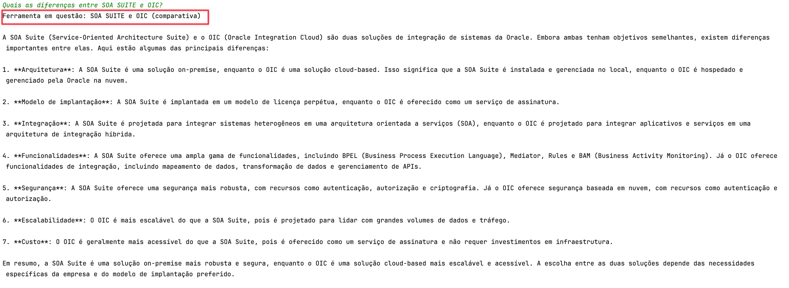

# Testando a OCI Generative AI

## Introdução

Apresento aqui um snippet da OCI Generative AI para consultas sobre funcionalidades do Oracle SOA SUITE e do Oracle Integration.

Ambas ferramentas são utilizadas hoje para estratégias de integração híbridas, ou seja, em ambientes Cloud e on-prem.

Como as ferramentas possuem funcionalidades e processos em comum, este código ajuda a entender melhor como executar uma mesma abordagem de integração em cada. Além disso, é possível explorar características comuns e diferenças.

### Pre-Requisitos

- Python 3.10 ou superior
- OCI CLI

### Instalando os pacotes Python

Instale os pacotes Python executando:

    pip install -r requirements.txt

## Testes

### Teste 1

Neste teste, mostro como é importante escrever o contexto o qual os documentos estão organizados e o objetivo desta organização, uma vez que temos documentos (manuais) sobre o SOA SUITE e também sobre o Oracle Integration.

Uma pergunta poderia levar a interpretações diferentes sobre ambas as ferramentas, o que pode levar a respostas erradas.

Neste teste 1, não há contexto nenhum prévio, portanto, teremos respostas que podem não levar a solução da questão corretamente.

O código irá permitir você a escrever suas perguntas. Assim que você teclar ENTER, receberá a resposta baseada nos materiais lidos (arquivos PDF).

Basta executar:

    python oci_genai_llm.py --device="mps" --gpu_name="M2Max GPU 32 Cores"

### Teste 2

Desta vez, neste teste 2, iremos dar um contexto para que se possa discernir entre SOA SUITE e o Oracle Integration, pois podemos ter as seguintes situações:

- A consulta deve ser feita somente para o SOA SUITE: Logo, devemos apenas considerar documentos do SOA SUITE
- A consulta deve ser feita somente para o Oracle Integration: Logo, devemos apenas considerar documento do Oracle Integration
- A consulta requer uma comparação entre SOA SUITE e Oracle Integration: Logo, devemos considerar todos os documentos

Podemos escrever o seguinte contexto, o que vai ajudar e muito na interpretação mais correta dos documentos:

Execute desta vez o seguinte código:

    python oci_genai_llm_context.py --device="mps" --gpu_name="M2Max GPU 32 Cores"

Exemplo de comparação entre SOA SUITE e Oracle Integration:

Exemplo sobre Kafka:

## Conclusão

Utilizar mecanismos de Generative AI é muito útil nos dias de hoje, o que trará ganhos de tempo, porém é necessária uma certa dose de paciência a raciocínio para tirar um melhor proveito.

A tecnologia traz um ganho enorme baseado numa quantidade de informação gigantesca, porém, informação interpretada de forma errada não é benéfico e o ganho de tempo funcionaria de forma contrária.

Não há dúvidas dos ganhos da Generative AI, porém é necessária uma validação e deveria ser humana.

## Referência

- [Extending SaaS by AI/ML features - Part 8: OCI Generative AI Integration with LangChain Use Cases](https://www.ateam-oracle.com/post/oci-generative-ai-integration-with-langchain-usecases)
- [Bridging cloud and conversational AI: LangChain and OCI Data Science platform](https://blogs.oracle.com/ai-and-datascience/post/cloud-conversational-ai-langchain-oci-data-science)
- [Install OCI CLI](https://docs.oracle.com/en-us/iaas/Content/API/SDKDocs/cliinstall.htm#Quickstart)
- [Introduction to Custom and Built-in Python LangChain Agents](https://wellsr.com/python/working-with-python-langchain-agents/)

## Acknowledgments

- **Author** - Cristiano Hoshikawa (Oracle LAD A-Team Solution Engineer)